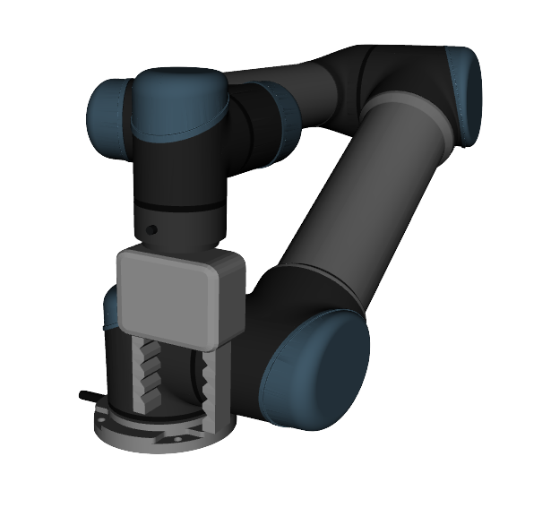

# UR5 Arm Pick and Place

Project on controlling a simulated robot to perform objects pick and place.
Inspired by Udacity's [Robotic arm - Pick & Place project](https://github.com/udacity/RoboND-Kinematics-Project)

### ROS Packages

* **ur5_arm**: main ROS nodes which performs Inverse Kinematics and interface with the simulation.

* **ur5_arm_gazebo**: robot arm simulation environment.

* **gripper_description**: custom gripper to use with the ur5 robot in the simulation.

### Dependencies

* [Universal Robot ROS Packages](https://github.com/ros-industrial/universal_robot)
