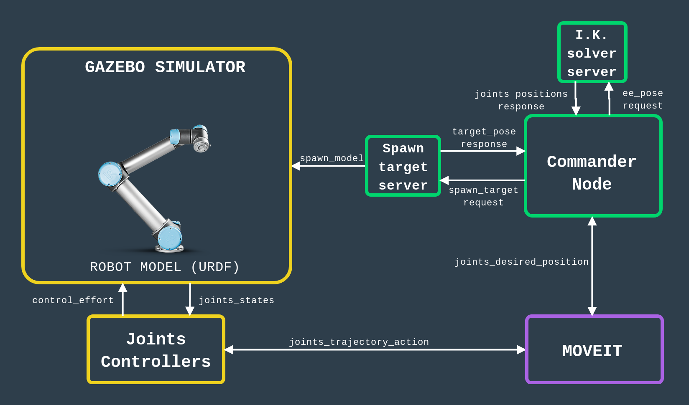

# Pick and Place

My take on simulating a pick and place task.
Inspired by Udacity's [Robotic arm - Pick & Place project](https://github.com/udacity/RoboND-Kinematics-Project), but with my own solution. I tried to make this a bit more more unique by using a different robot and using an IK solver based on [Dampened Least Sqares](https://www.math.ucsd.edu/~sbuss/ResearchWeb/ikmethods/iksurvey.pdf) instead of a purely geometrical one.

## Contens

#### Jupyter Notebooks

Refer to these for theory bits!

* **InverseKinematicsUR5**: Forward and Inverse Kinematics theory recap and python code snippets.

* **RobotSimulation**: Walkthrough on simulating and controlling a robot using MOVEIT! in ROS.

#### ROS Packages

* **ur5_arm**: ROS nodes used to perform control the simulated ur5 robot.

* **ur5_arm_gazebo**: Robot arm simulation world.

* **ur5_arm_description**: Custom UR5 robot URDF with gripper for the simulation environment.

* **gripper_description**: Custom gripper.

* **ur5_arm_moveit_config**: Package to control the UR5 robot using ROS MOVEIT!.

## Overview

This is how the simulated environment is setup:

<p align="center">
     
</p>

The goal is to pick the object wich spawns on a random location on the table.

## Usage

Here is a general overview on how the simulation framework works:

<p align="center">
     
</p>

**1- Start the simulation**: set ups the scene in gazebo and brings-up the robot arm.

```bash
roslaunch ur5_arm_gazebo ur5_grasping_world.launch 
```

**2- Start MOVEIT Planner**: starts the trajectory planner

```bash
roslaunch ur5_arm_moveit_config ur5_arm_planning_execution.launch 
```

**3- Start the pick and place commander**: starts the arm commander node plus the inverse kinematics solver and target spawner server nodes, follow the instructions in the terminal to start the grasping task.

```bash
roslaunch ur5_arm_moveit_config ur5_arm_planning_execution.launch 
```

## Dependencies

* [ROS Robot Operating System](https://http://wiki.ros.org/kinetic)
* [Universal Robot ROS-INDUSTRIAL Package](https://github.com/ros-industrial/universal_robot)

## References and Special Thanks

Not in any particular order:
* [Robot Ignite Accademy](https://www.theconstructsim.com/robotigniteacademy_learnros/ros-courses-library/) -> original gazebo scene and Moveit! tutorials used to set up the arm joint controllers.
* [Robotics Systems Lab](https://ethz.ch/content/dam/ethz/special-interest/mavt/robotics-n-intelligent-systems/rsl-dam/documents/RobotDynamics2018/RD_HS2018script.pdf) -> robotics kinematics and dynamics lecture notes.
* [Udacity](https://www.youtube.com/user/Udacity) -> original project idea & Simpy usage. URDF gripper files are also from here.
* [Rethink Robotics](https://github.com/RethinkRobotics/baxter_interface) -> Inspiration for the ROS Action Server python interface used for gripper and arm.
